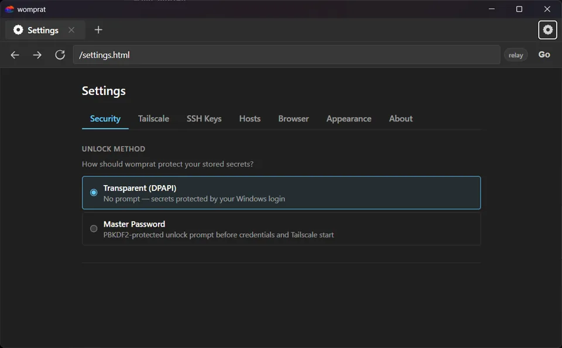

# womprat


`womprat` is a portable Windows (ARM64 and Intel) SSH terminal, browser, VNC viewer, and RDP viewer for your tailnet. It embeds Tailscale with `tsnet`, opens SSH sessions in tabbed terminals, provides native WebView2 browser tabs, and bridges VNC/RDP sessions through the same Tailscale connection, so you can reach machines, remote desktops, and web UIs on your tailnet from anywhere without installing the full Tailscale client.

This is meant to be dead simple: copy one executable, launch it, unlock your saved configuration, and get to the things that normally require a VPN client, a browser, an SSH client, and a pile of local setup.



## Why

I kept finding myself in places I couldn't install the full Tailscale client but needed it to access my own stuff. And sometimes you want access to a handful of machines without adding another persistent system service, changing the host network stack, or asking Windows to remember one more thing at boot.

And then I got a corporate, locked-down Windows ARM laptop to test and realized that I really wanted to get at my Proxmox cluster from outside the house.

`womprat` takes the opposite approach to setting up a VPN or a Tailscale client: the tailnet identity belongs to the app, not the machine. When it is running, it can reach your tailnet. When it is closed, there is no VPN client left behind.

That makes it useful for portable operations work, especially when SSH and internal web UIs are the only things you need.

> **Note:** Right now, configuration is encrypted but stored in %APPDATA%. Future passes will tackle running this straight off a USB stick, once the UX is a bit more stable.

Oh, and the name was, weirdly, the first Star Wars/Death Star trench-related thing that came to me. It was late.

## How networking works

The app starts an embedded Tailscale node through `tailscale.com/tsnet` and uses it for application traffic:

* SSH connections are dialled through `tsnet`.
* Native browser tabs use a loopback SOCKS5 endpoint whose upstream connections are dialled through `tsnet`.
* Managed HTTP(S) downloads use the same routing policy and are saved under the current user's `Downloads` directory. Only one managed download runs at a time.
* VNC and RDP WebSocket bridges dial their target hosts through `tsnet` and stream framebuffer/input data to the local shell.
* The SOCKS5 endpoint resolves and dials through `tsnet`, including public names, MagicDNS names, `.ts.net` names, `.local` aliases (if you use [`mdnsbridge`](https://github.com/rcarmo/mdnsbridge)), LAN names, and raw IPs.
* If exit-node routing is configured, `tsnet` lets you reach the open internet (also very handy if you end up on a restricted network).

Release builds fail closed: if the embedded Tailscale node is unavailable, SSH, browser, download, VNC, and RDP traffic is not silently sent over the host's normal network. The `WOMPRAT_DIRECT=1` bypass exists only in binaries explicitly built with `-X main.debugBuild=1` for local integration tests.

## What is in the binary

The executable contains the app shell, settings UI, tab manager, SSH terminal plumbing, SOCKS bridge, VNC/RDP viewers, embedded Tailscale client, and system WebView2 integration code. It does not bundle a browser engine -- it uses the Microsoft Edge WebView2 runtime already present on current Windows systems.

The main pieces are:

* `tsnet` for joining and routing over the tailnet.
* WebView2 for the native Windows browser window.
* `xterm.js` for SSH terminal tabs.
* Go's SSH stack for terminal sessions.
* A WASM-backed VNC framebuffer pipeline with Raw/Hextile/CopyRect/ZRLE/RRE/CoRRE support.
* A local `go-rdp` replacement for RDP connection, licensing, capabilities, and bitmap/surface update handling.
* Windows DPAPI for encrypting local configuration and credentials.
* A local HTTP API for the app shell, settings, tab state, terminal WebSockets, VNC WebSockets, and RDP WebSockets.

## Browser tabs

HTTP and HTTPS URLs open in native WebView2 child views, with the shell keeping tab titles, favicons, address-bar state, navigation history, zoom, ordering, and optional launch-time restoration in sync. The usual browser shortcuts work (`Ctrl+L`, `Ctrl+T`, `Ctrl+W`, `Ctrl+Tab`, `Ctrl+1` through `Ctrl+9`, `Ctrl+R`/`F5`, `Alt+Left`/`Alt+Right`, and `Ctrl++`/`Ctrl+-`/`Ctrl+0`). Terminal tabs use the corresponding `Ctrl+Shift` variants where a plain `Ctrl` chord belongs to the remote shell.

Links opened with `target=_blank` and common `window.open()` calls become Womprat tabs. Download links are handed to the managed downloader, which preserves the `tsnet` route, sanitises filenames, avoids overwriting an existing file, removes incomplete files, and reports progress in the shell.

WebView2 keeps its browsing profile under the Womprat configuration directory. Settings can clear cache, individual cookie domains, all cookies, saved passwords, or all browsing data. Cookie deletion matches exact hosts and real subdomains rather than arbitrary suffixes.

## Remote display tabs

VNC and RDP targets can be opened from the URL bar with normal custom URLs:

```text
vnc://host:5900
rdp://user@host:3389
```

Remote display tabs use a canvas-only workspace. The active session name and negotiated dimensions are promoted into the tab title, for example `sandbox:78 · 1024×768` or `rdp://host:3389 · 1280×720`, instead of taking space inside the canvas area.

### VNC

The VNC client intentionally negotiates Raw first for correctness across real servers that black-screen with some compressed encodings, then advertises faster/fallback encodings:

```text
Raw → Hextile → CopyRect → ZRLE → RRE → CoRRE → Cursor → ExtendedDesktopSize → DesktopSize → DesktopName → LastRect
```

VNC input supports pointer, wheel, clipboard, bounded cursor/desktop-name data, keypad keysyms, F1-F24, Meta/OS keysyms for NeXT-like targets, and active-key release on blur/reconnect/dispose to avoid stuck modifiers.

### RDP

RDP credentials are entered in a centred dialog. Once Connect is pressed, the dialog hides and the canvas is displayed. Status is shown in an auto-sized bottom-left bar styled like the browser status bar. Fit-to-viewport is the default display mode.

The initial remote desktop size comes from the visible content viewport. If the server negotiates MS-RDPEDISP Display Control, later browser-window changes request a matching remote desktop size without reconnecting or asking for credentials again. Servers without dynamic resize keep their negotiated framebuffer and the canvas fills the viewport locally; pointer coordinates independently invert the horizontal and vertical CSS scales, so mouse input still lands on the corresponding remote pixel.

The default RDP path advertises WASM-backed NSCodec, RemoteFX, RemoteFX-Image, and bitmap decoding. Negotiated support depends on the server. For compatibility with servers that need conservative bitmap updates, use an RDP URL/query path that reaches the WebSocket with `rfx=off`, `rfx=false`, `rfx=0`, or `compat=1`.

## Configuration and secrets

User data lives (for now) under:

```text
%APPDATA%\womprat\
```

`config.enc` contains the encrypted application state, including window geometry, open tabs, host metadata, appearance, exit-node choice, and diagnostics preferences. WebView2 maintains its browser profile below the same directory; runtime debug logs, when enabled, are written next to the executable.

Current unlock modes are intentionally simple:

* DPAPI user-scope unlock for normal per-user use.
* Master-password unlock for an explicit additional gate.

The Tailscale auth-key field is always masked and is only for replacing the key and reconnecting. SSH private keys are kept in Windows Credential Manager, and SSH host keys are pinned on first use rather than accepted blindly every time.

Debug logging is off by default. Enabling it writes the runtime log, enables WebView developer tooling for newly created views, and shows an attached Windows console when the process has one; disabling it stops file logging and hides that console. Normal Makefile releases use the Windows GUI subsystem and therefore launch without a console in the first place.

## What it does not do

`womprat` is not trying to replace the full Tailscale client for general-purpose system networking. It will not make every application on the machine see the tailnet, advertise routes, or act as a machine-wide VPN.

It also does not provide a generic proxy service--the entire point of this is that this is a single-purpose, self contained app.

## Building

The project Makefile is the supported build entry point:

```bash
make doctor
make setup
make verify
make windows-arm64
```

For a clean end-to-end build:

```bash
make release
```

The default target is documented with:

```bash
make help
```

The Windows builds emit:

```text
dist/womprat-windows-arm64.exe
dist/womprat-windows-amd64.exe
```

Use `make windows-arm64` for ARM64, `make windows-amd64` (or `make windows-intel`) for Intel/AMD x64, and `make sha256` after building one or both to write `dist/SHA256SUMS.txt`.

Both Windows targets use `-H windowsgui`, so normal releases launch without a console window. Developer builds that retain the console subsystem can use the Debug Logging setting to show or hide their attached console.

## Build dependencies

You need:

* Go, with Windows ARM64 cross-compilation support.
* Bun, used to sanity-check the embedded HTML/JavaScript entry points.
* `llvm-windres`, used to generate the Windows ARM64 resource object.
* Python 3, currently used as a general project scripting dependency.

The `Makefile` checks these with `make doctor` and regenerates Windows `.syso` resource objects from the checked-in icon and manifest.

## Repository layout

```text
womprat/
├── cmd/
│   └── womprat/              Application entry point (package main)
│       ├── main.go           WebView2 shell, tab model, browser bindings
│       ├── gui_windows.go    Native dual-WebView host window (Windows)
│       ├── socks.go          Tailscale-backed SOCKS5 endpoint
│       ├── vnc.go            VNC WebSocket-to-TCP bridge through tsnet
│       ├── rdp.go            RDP WebSocket bridge through tsnet
│       ├── download.go       Managed HTTP(S) downloads through tsnet
│       ├── ws_terminal.go    SSH terminal WebSocket bridge
│       ├── settings_api.go   Settings HTTP API
│       ├── config.go         Encrypted app configuration model
│       ├── logging.go        Runtime log and diagnostics controls
│       ├── console_windows.go Debug-console visibility on Windows
│       ├── frontend/         HTML, CSS, and JavaScript for the app shell/settings
│       └── winres/           Windows icon resource inputs
├── internal/
│   └── go-webview2/          Vendored WebView2 wrapper (local replace) with patches
├── third_party/
│   └── go-rdp/               Local RDP module replacement used by go.mod
├── tests/
│   └── ux/                   Playwright shell and real-remote UX smoke tests
├── docs/
│   ├── icon.png             Source application icon
│   └── icon-256.png         README-sized icon
└── Makefile                 Full setup/check/resource/build pipeline
```

## Platform status

Windows ARM64 is the primary target, and Windows AMD64/Intel x64 is a supported Makefile build. Both use the native dual-WebView2 host. Linux builds exist for automated tests and debugging: headless mode serves the shell/API for Playwright, while `make linux-gui` builds the WebKitGTK shell when its development packages are installed. The Darwin target is a compile sanity check rather than a supported desktop application.

## Roadmap

* Make this a fully portable, USB keychain-style app
* Continue hardening RDP compatibility/performance across real servers
* Possibly do a Mac version
