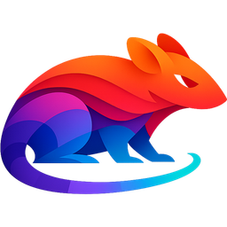

# womprat



`womprat` is a portable Windows (ARM64 and Intel) SSH terminal and browser for your tailnet. It embeds Tailscale with `tsnet`, opens SSH sessions in tabbed terminals, and navigates WebView2 browser tabs through the same Tailscale path, so you can reach machines and web UIs on your tailnet from anywhere without installing the full Tailscale client on the host.

This is meant to be dead simple: copy one executable, launch it, unlock your saved configuration, and get to the things that normally require a VPN client, a browser, an SSH client, and a pile of local setup.

## Why

I kept finding myself in places I couldn't install the full Tailscale client but needed it to access my own stuff. And sometimes you want access to a handful of machines without adding another persistent system service, changing the host network stack, or asking Windows to remember one more thing at boot.

`womprat` takes the opposite approach: the tailnet identity belongs to the app, not the machine. When it is running, it can reach your tailnet. When it is closed, there is no VPN client left behind.

That makes it useful for portable operations work, especially when SSH and internal web UIs are the only things you need.

> **Note:** Right now, configuration is encrypted but stored in %APPDATA%. Future passes will tackle running this straight off a USB stick, once the UX is a bit more stable.

Oh, and the name was, weirdly, the first Star Wars/Death Star trench-related thing that came to me. It was late.

## How networking works

The app starts an embedded Tailscale node through `tailscale.com/tsnet` and uses it for application traffic:

* SSH connections are dialled through `tsnet`.
* Browser traffic is sent to a local SOCKS5 endpoint.
* The SOCKS5 endpoint resolves and dials through `tsnet`, including public names, MagicDNS names, `.ts.net` names, `.local` aliases (if you use [`mdnsbridge`](https://github.com/rcarmo/mdnsbridge)), LAN names, and raw IPs.
* If exit-node routing is configured, `tsnet` lets you reach the open internet (also very handy if you end up on a restricted network).

## What is in the binary

The executable contains the app shell, settings UI, tab manager, SSH terminal plumbing, SOCKS bridge, embedded Tailscale client, and system WebView2 integration code. It does not bundle a browser engine -- it uses the Microsoft Edge WebView2 runtime already present on current Windows systems.

The main pieces are:

* `tsnet` for joining and routing over the tailnet.
* WebView2 for the native Windows browser window.
* `xterm.js` for SSH terminal tabs.
* Go's SSH stack for terminal sessions.
* Windows DPAPI for encrypting local configuration and credentials.
* A local HTTP API for the app shell, settings, tab state, and terminal WebSockets.

## Configuration and secrets

User data lives (for now) under:

```text
%APPDATA%\womprat\
```

The app stores its configuration as encrypted local state and keeps credentials protected with Windows DPAPI. Current unlock modes are intentionally simple:

* DPAPI user-scope unlock for normal per-user use.
* Master-password unlock for an explicit additional gate.

SSH host keys are pinned on first use rather than accepted blindly every time, which keeps the first-run experience tolerable without pretending that SSH host verification does not matter.

## What it does not do

`womprat` is not trying to replace the full Tailscale client for general-purpose system networking. It will not make every application on the machine see the tailnet, advertise routes, or act as a machine-wide VPN.

It also does not provide a generic proxy service--the entire point of this is that this is a single-purpose, self contained app.

## Building

The project Makefile is the supported build entry point:

```bash
make doctor
make setup
make verify
make windows-arm64
```

For a clean end-to-end build:

```bash
make release
```

The default target is documented with:

```bash
make help
```

The Windows ARM64 build emits:

```text
womprat.exe
```

The GUI build uses `-H windowsgui` so launching the executable does not create a console window.

## Build dependencies

You need:

* Go, with Windows ARM64 cross-compilation support.
* Bun, used to sanity-check the embedded HTML/JavaScript entry points.
* `llvm-windres`, used to generate the Windows ARM64 resource object.
* Python 3, currently used as a general project scripting dependency.

The `Makefile` checks these with `make doctor` and regenerates the ARM64 `.syso` resource from the checked-in icon and manifest.

## Repository layout

```text
frontend/                 HTML, CSS, and JavaScript for the app shell/settings
winres/                   Windows icon resource inputs
docs/icon.png             Source application icon
docs/icon-256.png         README-sized icon
main.go                   WebView2 shell, tab model, browser bindings
socks.go                  Tailscale-backed SOCKS5 endpoint
ws_terminal.go            SSH terminal WebSocket bridge
settings_api.go           Settings HTTP API
config.go                 Encrypted app configuration model
Makefile                  Full setup/check/resource/build pipeline
```

## Current target

The current target platform is Windows ARM64. Other build targets exist mostly as compile checks; the useful artefact is the single Windows ARM64 `womprat.exe`.

## Roadmap

* Make this a fully portable, USB keychain-style app
* Embed VNC and [`go-rdp`](https://github.com/rcarmo/go-rdp) clients
* Possibly do a Mac version
